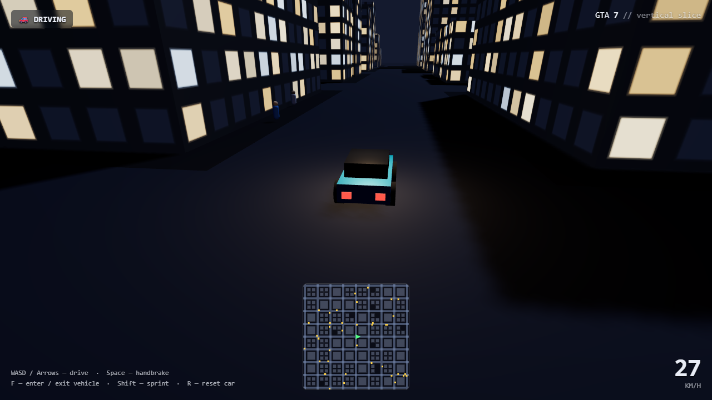
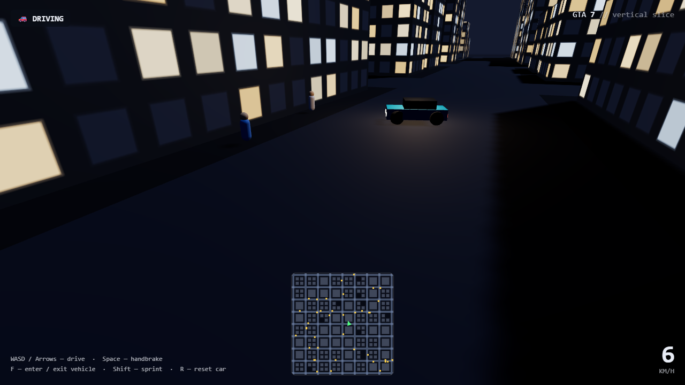
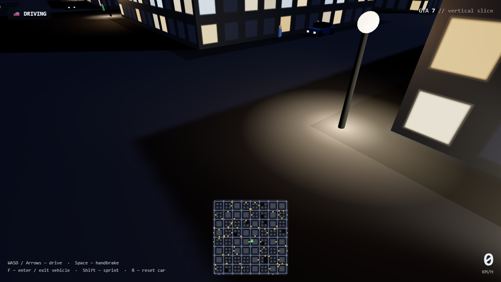
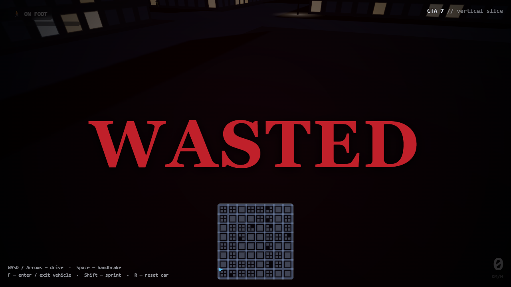
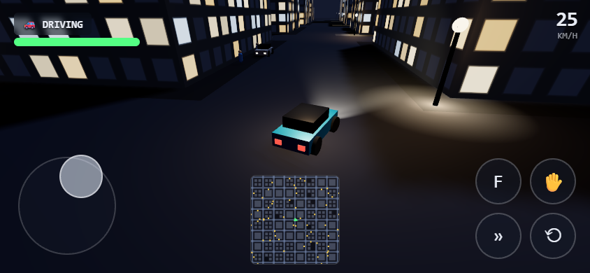
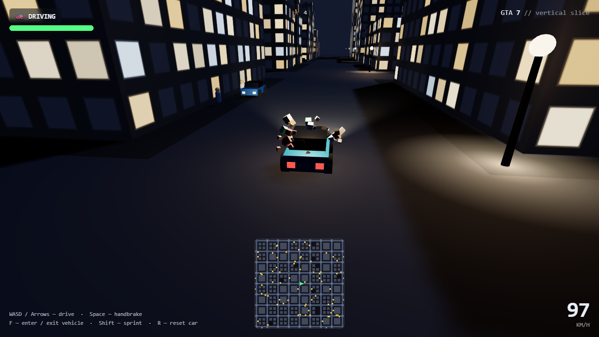
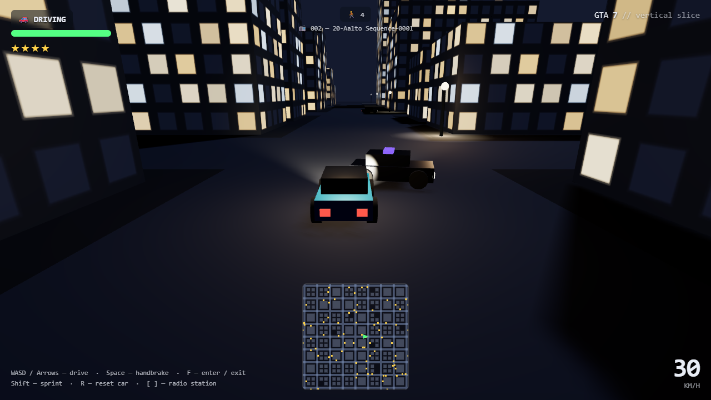

# GTA 7 🚗🌃

### ▶ [Play the live demo](https://depixeled-chris.github.io/gta7/)

🕹️ Curious where it started? [Play the original zero-shot version](https://depixeled-chris.github.io/gta7/zero-shot/) — the first single-shot build, before any of the community feature requests below.

> A from-scratch, browser-based **GTA-style 3D open-world vertical slice** — built in TypeScript + Three.js in a single session, because a Reddit thread dared a new model to.
>
> No, it is not Grand Theft Auto VII. It's a procedural neon city you can drive around at night, hop out of the car, and wander on foot. The name is the joke.
>
> Works on desktop (keyboard) and mobile (on-screen touch controls).



## Features

- **Procedural night city** — a seeded grid of streets and hundreds of lit-window towers; same seed always rebuilds the same skyline.
- **Lit streets** — a streetlight on every corner casting warm pools of light, plus working twin headlights on the car you're driving.
- **Arcade driving with powerslides** — a velocity-vector handling model with tyre grip; yank the handbrake mid-corner and the back end steps out into a drift.
- **Carjack anything** — walk up to *any* car — your spawn ride, ambient traffic, or one of the cars parked along the curbs — and get in.
- **Physical cars** — solid buildings and momentum-based car-on-car impacts: ram traffic and it gets shoved off course.
- **Traffic that brakes for you… mostly** — stand in the road and oncoming cars slow and stop; dart out from inside their stopping distance and they can't help it. Get hit and you lose health; run out and it's **WASTED**, then you respawn.
- **Run people over** — flatten a pedestrian at speed and they burst into a shower of little cubes; your tally shows on the HUD. (Ambient traffic is lethal too, but only your kills count.)
- **Ambient life** — traffic looping the avenues and pedestrians milling the streets.
- **Wanted level & police chase** — run people over and your heat climbs into a ★–★★★★★ wanted rating; every star puts another cop car on your tail (flashing lights and all). They use steering-behavior AI — they lead/intercept you, fan out instead of stacking up, and veer around buildings. Getting WASTED clears it.
- **Pedestrians react** — get close on foot and they panic: trembling and bolting away from you.
- **Synthesized sound** — an engine note with a faked automatic gearbox (revs climb, then drop on each upshift), tyre screech when you drift, a crunch when you gib someone, and door blips getting in/out — all generated in-browser, no audio files.
- **Car radio** — 7 stations of original music streamed from a CDN (never bundled); tune with `[` / `]`. Each car remembers its own (initially random) station, drops you in mid-broadcast, and keeps playing after you get out — fading with distance as you walk away. The next song is prefetched while the current one plays.
- **Plays on mobile** — keyboard on desktop, an on-screen analog joystick + action buttons on touch devices (auto-detected), with quality scaled down for phone GPUs.
- **HUD + live minimap** — speedometer, health, mode indicator, and a top-down radar of the city and traffic.
- **Backed by tests** — the simulation core (vehicle physics, city generation, collision, RNG) is pure and unit-tested; headless-Chromium tests prove the scene renders *and* that driving, carjacking, and collisions actually work.








## Play it

```bash
npm install
npm run dev      # then open the printed localhost URL
```

### Controls

| Action | Keys |
| --- | --- |
| Drive / move | `W` `A` `S` `D` or arrow keys |
| Handbrake (powerslide) | `Space` |
| Enter / exit nearest vehicle | `F` |
| Sprint (on foot) | `Shift` |
| Reset car | `R` |
| Radio station (prev / next) | `[` / `]` |

On a touch device the same actions map to an on-screen joystick (steer + throttle / move) and buttons (enter-exit · handbrake · sprint · reset).

## Develop

```bash
npm test          # unit tests for the pure simulation core (Vitest)
npm run build     # typecheck + production build
npm run smoke     # build + headless-Chromium render check
npm run test:e2e  # render check + gameplay interaction test (collision, carjacking, shoving)
```

The browser tests need Chromium once: `npx playwright install chromium`.

See [`CLAUDE.md`](CLAUDE.md) for architecture — the short version: gameplay logic is kept pure and Three.js-free so it's testable in node, and everything that touches `three` lives in a separate rendering layer.

## Tech

[Three.js](https://threejs.org/) · [TypeScript](https://www.typescriptlang.org/) · [Vite](https://vitejs.dev/) · [Vitest](https://vitest.dev/) · [Playwright](https://playwright.dev/) (smoke test)

## Requested by the internet

This whole thing is a community-driven dare, built live from requests. Credit where it's due:

- **The original dare** — [u/Mr_Versatile](https://www.reddit.com/r/ClaudeAI/comments/1tqz2se/lets_check_opus_48_how_good_is_it/), *"Let's check Opus 4.8 — how good is it?"*
- **Streetlights, parked cars, headlights, powerslides, faster cars, health + WASTED, traffic that brakes for you, smoother framerate, no-pinch-zoom, slow-bump-vs-fast-gib, this demo link** — u/daemon-electricity
- **Mobile / touch support** — u/Specialist_Juce879
- **Being able to run pedestrians over** — u/Syrus_101 (*"I couldn't run over anyone. Unacceptable."*)
- **Pedestrians exploding into tiny block parts** — u/jrobertson50
- **Reverse-steering sanity check** — u/Marathon2021 (verified: it's realistic rear-steer, now locked by a test)
- **Radio stations** — u/aweh_sassy
- **Police chasing you** — u/c0desurfer (*"Didn't even implement police chasing me. Boring 😄"*)
- **Sound effects, smarter police, radio shuffle** — u/daemon-electricity
- **Pedestrians fleeing in fear on foot** — u/This-Shape2193
- **Punching pedestrians into pixels on foot** — u/Fit-Dot-414

🎵 All radio music is by **Daemon Electricity** — [SoundCloud](https://soundcloud.com/daemonelectricity), and also on Spotify, Apple Music, Amazon, Deezer, Tidal, and most platforms. The tracks stream from a [GitHub Release](https://github.com/depixeled-chris/gta7/releases/tag/radio-v1) rather than being bundled into the site.

Got a request? It probably came from [the thread](https://www.reddit.com/r/ClaudeAI/comments/1tqz2se/lets_check_opus_48_how_good_is_it/).

## License

MIT — have fun with it.
